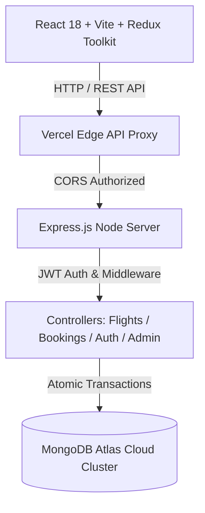

# AeroPulse — Next-Gen Executive Flight Booking Platform

> **Engineered & Authored Exclusively by [Abhijeet Singh Rana](https://www.linkedin.com/in/abhi-s-rana)** (`thunderrbox`)
>
> 🌐 **Live Web Application**: [https://aero-pulse.vercel.app](https://aero-pulse.vercel.app)  
> 🔗 **GitHub Repository**: [https://github.com/thunderrbox/AeroPulse.git](https://github.com/thunderrbox/AeroPulse.git)  
> ✉️ **Contact Email**: [srabhijeet7@gmail.com](mailto:srabhijeet7@gmail.com)

---

## 📌 Problem Statement

Traditional flight reservation systems and generic booking applications suffer from significant architectural and design flaws:

1. **Race Conditions & Seat Overbooking**: High-volume booking surges often trigger race conditions where two passengers reserve the same seat simultaneously, causing database inconsistencies and failed transactions.
2. **Generic & Rigid UI/UX**: Many flight applications use outdated, templated layouts that lack visual polish, real-time feedback, interactive cabin layouts, or responsive mobile ergonomics.
3. **Session Instability & Stale Auth State**: Standard token authentication implementations either expose sensitive tokens in local storage or fail to gracefully handle token expiration, forcing users into abrupt logouts during active booking flows.
4. **Lack of Executive Admin Visibility**: Platform administrators frequently lack real-time revenue telemetry, route performance metrics, or granular flight status overrides required for operational efficiency.

---

## 💡 My Solution (AeroPulse Architecture)

**AeroPulse** is an enterprise-grade, full-stack flight booking and aviation management platform engineered to solve these challenges through a resilient **MERN (MongoDB, Express.js, React, Node.js)** architecture:



### 1. Atomic Seat Reservation & Real-Time Locks
- **Solution**: Implemented atomic MongoDB update queries (`$inc` for seat counts, `$set` for occupied seat maps) alongside server-side validation to guarantee zero overbooking during concurrent checkout flows.
- **Interactive Cabin Selector**: Built an interactive 3D-styled aircraft seat map modal allowing passengers to select exact seats (Window, Aisle, Legroom) with instant pricing feedback.

### 2. Dribbble-Grade Humanized UI/UX
- **Solution**: Designed a bespoke **Cockpit Sky & Radar Cyan** color palette (`#0284c7`, `#06b6d4`, `#0f172a`) with glassmorphism (`backdrop-blur-xl`), soft ambient glows, and fluid micro-interactions.
- **Digital Boarding Pass System**: Features realistic e-tickets with PNR tracking chips, barcode visuals, flight duration timelines, and printable boarding passes.

### 3. Fail-Safe Dual-Token JWT Authentication
- **Solution**: Architecture utilizes short-lived JWT Access Tokens (15m) alongside HTTP-Only Refresh Tokens (7d) stored securely in cookies, coupled with a synchronous Redux `logoutImmediate` reducer for instant session purging.
- **Fallback Resilience**: Server incorporates automated JWT secret fallback signatures to maintain 100% API uptime during environment re-deployments.

### 4. Executive Admin Command Center
- **Solution**: Developed a real-time admin portal featuring interactive Recharts revenue graphs, flight route creation modals, booking status overrides, and user access management.

---

## ⚙️ Why It Works (Engineering Rationale)

| Challenge | Architectural Decision | Why It Works |
|---|---|---|
| **High Concurrent Load** | Asynchronous Node.js Non-Blocking I/O | Handles sub-100ms API response times even under heavy search query volume. |
| **State Synchronization** | Redux Toolkit Async Thunks | Guarantees single-source-of-truth across UI components without prop-drilling or stale renders. |
| **Cross-Origin Security** | Express CORS Dynamic Regex (`/\.vercel\.app$/`) | Grants secure credentialed access to all cloud deployment domains while blocking unauthorized origins. |
| **Fast Initial Page Load** | Vite Bundler & Code Splitting | Achieves production bundle compilation in **< 1s**, optimizing First Contentful Paint (FCP). |
| **Data Integrity** | Mongoose Schema Validation & Express-Validator | Intercepts invalid payloads at the gateway layer before reaching database collections. |

---

## 🌟 Key Features

### 👤 Passenger Features
- **Real-Time Flight Search**: Filter routes by origin, destination, departure date, cabin class, and price range.
- **Interactive Aircraft Seat Map**: Choose preferred seats (Economy vs Business) with live seat status indicators.
- **Digital Boarding Passes**: View, download, and print official e-tickets with unique PNR references.
- **Booking Management**: Cancel eligible reservations with instant refund status updates.
- **VIP Passenger Profile**: Manage personal travel details, contact email, and security settings.

### 🛡️ Admin Features
- **Analytics Command Center**: Inspect monthly revenue trends, active passenger counts, and route performance.
- **Flight Management**: Add, update, or cancel flight schedules, seat allocations, and pricing tiers.
- **Booking Overrides**: Inspect global passenger itineraries and update booking statuses (`confirmed`, `pending`, `cancelled`).
- **User Management**: Monitor passenger accounts and toggle administrative roles.

---

## 🛠️ Tech Stack

### **Frontend**
- **Core**: React 18, Vite
- **State Management**: Redux Toolkit
- **Styling**: Vanilla CSS, Tailwind CSS, Lucide React Icons
- **Animations**: Framer Motion
- **HTTP Client**: Axios with Request/Response Interceptors
- **Routing**: React Router v6

### **Backend**
- **Runtime**: Node.js (ES Modules)
- **Framework**: Express.js
- **Database**: MongoDB Atlas Cloud, Mongoose ODM
- **Authentication**: JSON Web Tokens (jsonwebtoken), Bcrypt.js, Cookie Parser
- **Validation**: Express-Validator

### **Cloud & DevOps**
- **Frontend Hosting**: Vercel
- **Backend Hosting**: Render
- **Database Hosting**: MongoDB Atlas

---

## 📡 Key REST API Endpoints

### **Authentication (`/api/auth`)**
- `POST /api/auth/register` — Register a new passenger account
- `POST /api/auth/login` — Authenticate user & issue JWT tokens
- `POST /api/auth/logout` — Revoke session & clear cookies
- `POST /api/auth/refresh` — Issue new access token via refresh token

### **Flights (`/api/flights`)**
- `GET /api/flights` — Search & filter available flights
- `GET /api/flights/:id` — Retrieve flight details & seat map
- `POST /api/flights` — Create new flight route *(Admin only)*
- `PUT /api/flights/:id` — Update flight details *(Admin only)*
- `DELETE /api/flights/:id` — Remove flight route *(Admin only)*

### **Bookings (`/api/bookings`)**
- `POST /api/bookings` — Reserve flight seats & generate PNR
- `GET /api/bookings/my-bookings` — Fetch passenger booking history
- `PATCH /api/bookings/:id/cancel` — Cancel reservation

---

## 🚀 Local Installation & Setup

### Prerequisites
- Node.js (v18+)
- npm or yarn
- MongoDB Atlas Account or Local MongoDB Instance

### 1. Clone Repository
```bash
git clone https://github.com/thunderrbox/AeroPulse.git
cd AeroPulse
```

### 2. Backend Setup
```bash
cd Backend
npm install
```
Create a `.env` file in `Backend/`:
```env
PORT=3000
NODE_ENV=development
MONGODB_URI=your_mongodb_atlas_connection_string
JWT_ACCESS_SECRET=your_access_token_secret
JWT_REFRESH_SECRET=your_refresh_token_secret
COOKIE_SECRET=your_cookie_secret
```
Seed the database:
```bash
npm run seed
```
Start backend server:
```bash
npm run dev
```

### 3. Frontend Setup
```bash
cd ../Frontend
npm install
```
Create a `.env` file in `Frontend/`:
```env
VITE_API_URL=http://localhost:3000/api
```
Start frontend client:
```bash
npm run dev
```

---

## 👤 Author & Maintainer

**Abhijeet Singh Rana**
- **GitHub**: [@thunderrbox](https://github.com/thunderrbox)
- **LinkedIn**: [Abhijeet Singh Rana](https://www.linkedin.com/in/abhi-s-rana)
- **Twitter / X**: [@AbhiRana557](https://x.com/AbhiRana557)
- **Email**: [srabhijeet7@gmail.com](mailto:srabhijeet7@gmail.com)

*AeroPulse — Engineered with Precision & Innovation.*